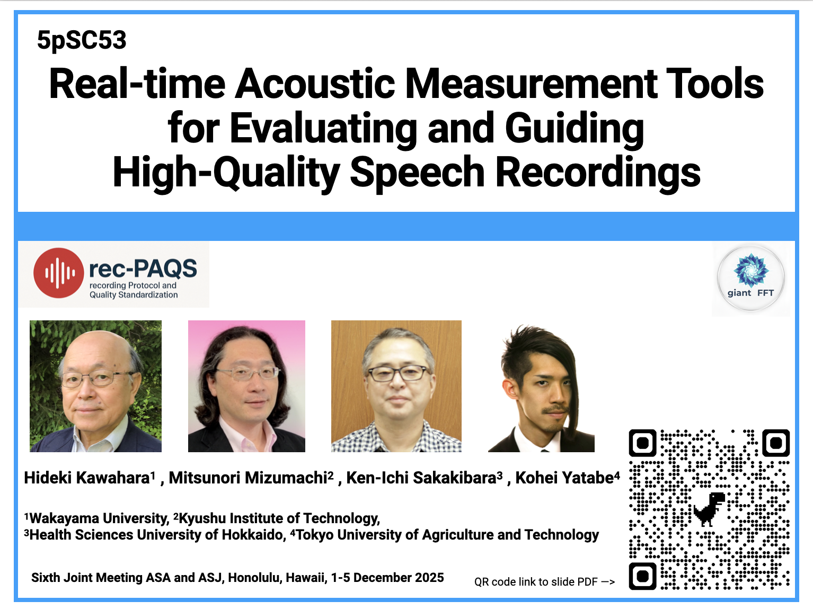
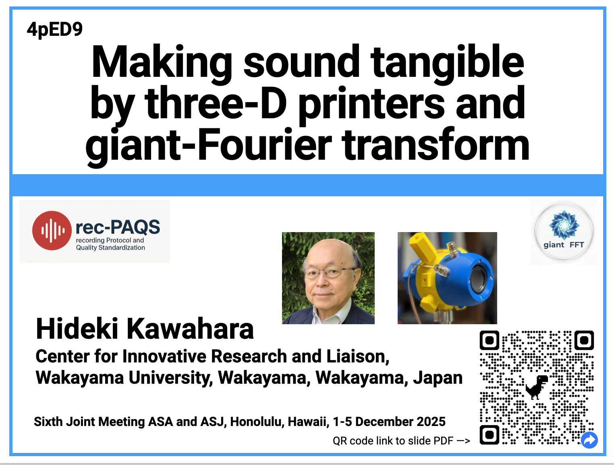

# What is giang-FFT SRC

Välimäki, V., & Bilbao, S. (2023). Giant FFTs for Sample-Rate Conversion.
Journal of the Audio Engineering Society, 71(3), 88–99.
DOI: https://doi.org/10.17743/jaes.2022.0061

# acouticCheckerByGFFT
This is an applicatio nof giant-FFT for acoustic measurement tool. Please check acouticCheckerByGFFT.md in doc folder. This is a pre-release version. Stay tuned.

# Giant_FFT_SSG
Signal Safeguarding with giant-FFT-based implementation. It makes any sound appropriate for acoustic measurement. Additionally, signal safeguarding can be applied retrospectively.

# How to start
For a single-microphone test, please take a look at QuickStart_oneShotSGforMonoInput.

For using the two-microphone test, please take a look at QuickStart_oneShotSGforTwoInputs.

# Video demo

[https://youtu.be/1tteAfbi3bI](https://youtu.be/W0MVSrcgNzQ?si=FbYxhfuaFvrMVjYe)

